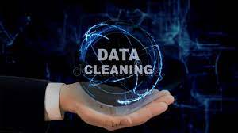

# Data Cleaning

Data cleaning is the process of fixing or removing incorrect, corrupted, incorrectly formatted, duplicate, or incomplete data within a dataset. When combining multiple data sources, there are many opportunities for data to be duplicated or mislabeled.
  

 

You can see my notebook. All  the work is explained in detail.

### AUTHOR

<strong>Mahnoor Rana</strong>

You can get in touch with me on my LinkedIn Profile:

You can also follow my GitHub Profile to stay updated about my latest projects:

If you liked the repo then kindly support it by giving it a star ⭐.